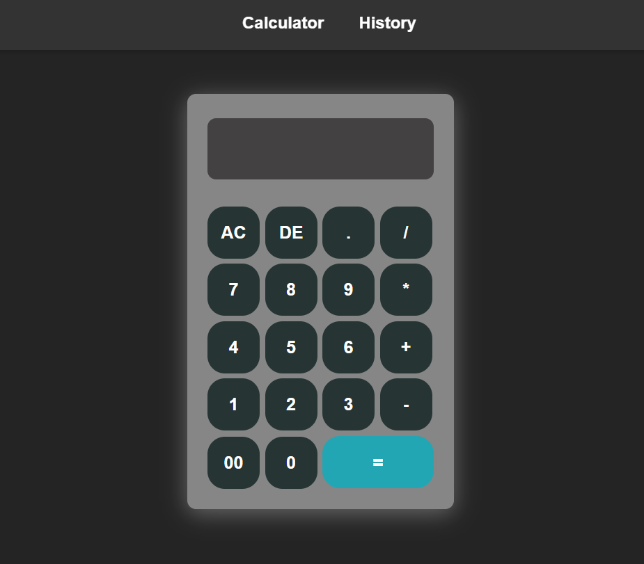
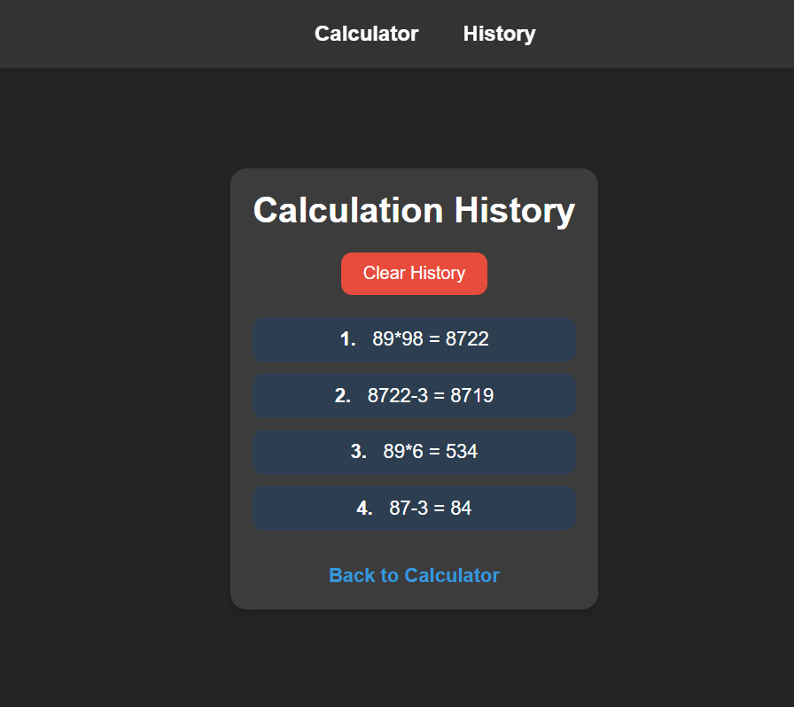

Calculator with History Tracking
A simple calculator application built with React that allows users to perform basic arithmetic operations and save the calculation history. Users can view their calculation history on a separate page and clear the history when needed.

Features
Basic arithmetic operations: addition, subtraction, multiplication, and division.
Decimal point support.
Calculation history tracking.
View history on a separate page.
Clear history functionality.
Responsive design.

Live Demo : 

